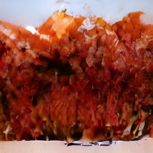
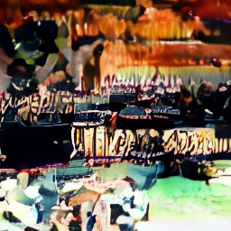

# DiffMamba-VLM: A Bidirectional-Mamba Masked-Diffusion Vision-Language Model

**Status:** Stage 1 (image→text understanding) **and** Stage 2 (text→image generation)
proofs complete. 2026-06-03.
**Scope:** A standout/differentiated portfolio piece — the point is *novelty + honest
rigor*, not leaderboard accuracy. Built additively on top of
[DiffMamba](./DiffMamba_Report.md); the text-only project is unchanged.

The model both **understands** images (Stage 1: VQAv2 exact-match 0.29) and **generates**
them (Stage 2: text-conditioned images, CLIP matched > shuffled) on one bidirectional-Mamba
masked-diffusion backbone — a small-scale "MMaDA-with-Mamba." Stage 1 is §§1–6; Stage 2 is §8.

## 1. One-line contribution

A **unified-style multimodal masked-diffusion language model with a bidirectional
Mamba-2 (SSM) backbone** — "MMaDA, but with a Mamba backbone, at small scale." Public
diffusion-LM VLMs (LLaDA-V, MMaDA) are Transformer-based; pairing a **state-space
backbone** with **masked-diffusion** image understanding is rare-to-nonexistent. This
report shows the combination *works* end-to-end and characterises its quality honestly at
130M, proof-run scale.

## 2. Method

**Backbone (reused, frozen-then-tuned).** The DiffMamba 130M bidirectional Mamba-2 MDLM
denoiser (hidden 768 / 12 blocks, AdaLN noise conditioning, SUBS parameterization),
warm-started from the tuned text checkpoint `runD_130m` (lr 1e-3, text val PPL 79.3).

**Vision (frozen).** SigLIP `google/siglip-base-patch16-224` → 196 patch tokens (768-d).

**Projector (trained).** 2-layer GELU MLP, 768→768, mapping SigLIP patches into the LM
embedding space (LLaVA-1.5 style).

**Conditioning mechanism — the key design.** The diffusion sequence is **text-only**. Image
features are projected and **prepended as a clean (never-noised) prefix in embedding space**
via the backbone's existing `inputs_embeds` hook, then the image positions are **sliced off
before the loss**. So the entire diffusion machinery (absorbing-state `q_xt`, the SUBS loss,
the attention/loss masks) operates only on the text span and is reused unchanged — no
surgery to the Mamba stack. Mamba has no positional embeddings, so the prefix needs zero
position handling; the forward-direction recurrence propagates image context to the text.

**Conditional masking.** Only the **answer span** is noised; the prompt (question/caption
instruction) and the image stay clean conditioning. The MDLM loss is weighted to answer
tokens via a `loss_mask`.

**Inference.** Iterative unmasking of the answer span, conditioned on the fixed image prefix
and prompt; the prompt is held fixed across all denoising steps.

## 3. Training (proof-run, two-phase LLaVA recipe)

All on Northeastern Explorer (A100-80GB, 8h job-chaining); frozen SigLIP features are
precomputed once to a float16 disk memmap and reused across segments. Cash cost ≈ $0.

| Phase | Trainable | Data | Steps | Result |
|---|---|---|---|---|
| **Align** | projector only (3.1M); backbone frozen | CC3M captions (`pixparse/cc3m-wds`), ~80K | 6000 | best val/nll **3.87** |
| **SFT** | projector + backbone (full FT, 128M) | VQAv2 (`lmms-lab/VQAv2`), ~40K | 8000 | — |

SFT warm-starts from the align checkpoint (backbone **and** trained projector).

## 4. Results

**Held-out VQAv2 (200 examples the model never trained on), 64 denoising steps:**

| Metric | v1 (answer-only loss) | v2 (full-span loss) |
|---|---|---|
| Exact-match (normalized answer == gold) | 0.250 | **0.290** |
| Gold-answer recall (gold appears in the answer) | 0.330 | 0.290 |

**v1 → v2: a train/inference fix (see §4.1).** v2 produces clean, terminated answers, so
exact-match rose and the two metrics converged to 0.29 — in v1 the higher recall (0.33) was
*inflated* by verbose rambling that incidentally mentioned the gold word; in v2 the prediction
*is* the answer.

### 4.1 Termination fix (honest-engineering note)

v1 supervised only the answer + EOS tokens, leaving the trailing padding clean and
unsupervised. But inference masks and generates the **entire** post-prompt span — including
the positions that were pad in training — so the model had never learned to emit EOS and stop,
and it filled every slot, rambling. v2 supervises the **full post-prompt span (answer + EOS +
pad)**, matching generation. Effect: outputs went from paragraphs to clean short answers, e.g.
`What is in the image? → "blue"`, `"no"`, `"3"`, `"white"`, and exact-match improved 0.25→0.29.

**Qualitative (image→text).** The model **grounds text in the image** — answers are
image-influenced (e.g. food images → food words; vehicles → "motorcycle"/"plane"). v2 answers
are short and well-formed but **lean on common VQA priors** — colors, yes/no, and counts
("blue", "black", "no", "white", "3") are over-represented. So it answers in the right *form*
and is image-conditioned, but defaults to high-frequency answers rather than fine visual
reasoning — the expected behaviour at 130M, proof-run scale.

## 5. Honest limitations

- **130M quality ceiling + answer-prior reliance.** The backbone already trails its own DiT
  baseline on *text* (79.3 vs 70.5 ppl); VLM quality inherits that ceiling. After the
  termination fix (§4.1) answers are clean and well-formed but lean on high-frequency VQA
  answers (colors / yes-no / counts) rather than fine visual reasoning — expected at this
  scale, not a bug.
- **Proof-run scale.** ~80K caption + ~40K VQA examples, 6K+8K steps — a fraction of the
  LLaVA recipe (558K + 150K). Numbers would improve with scale but the qualitative story
  (works, modest) would not change materially at 130M.
- **VQA exact-match caveat.** VQAv2 is ~38% yes/no with "yes" dominant, so part of the 25%
  exact-match reflects answer-prior/yes-bias, not full visual reasoning. Gold-recall (33%)
  and the qualitative samples are the more informative signals.
- **Eval source.** SFT trained on a subset of the VQAv2 *validation* split; eval used a
  disjoint held-out slice of the same split (the model never saw those examples), not the
  official test server.
- **Forward-pass framing.** This is Stage 1 (understanding) only.

## 6. Why a Mamba backbone (motivation carried from DiffMamba)

The text-only DiffMamba study showed BiMamba-2 is **linear-time** and overtakes flash-attn
DiT in throughput beyond ~3K tokens (3.1× at 32K). A VLM built on this backbone **inherits
that long-context efficiency** — relevant as image-token counts and multi-image / video
contexts grow. (Not separately benchmarked here; inherited from the backbone.)

## 7. Stage 1 conclusion

Stage 1 establishes that a **bidirectional-Mamba masked-diffusion VLM** trains and conditions
on images end-to-end (image→text understanding), reproducing the expected small-scale
quality/throughput trade-off honestly.

## 8. Stage 2 — text→image generation

Stage 2 extends the same backbone to **generate images from text**, then is the basis for a
unified understand-and-generate model.

### 8.1 Method

Generation is **pure tokens in / tokens out** — sequence
`[BOS] caption [BOI] <1024 VQ image tokens> [EOI]` — so it reuses the original text DiMamba
path (no SigLIP, no projector) with an **expanded vocabulary**: text `[0..50256]` + `[MASK]` +
`[BOI]`/`[EOI]` + **4096 VQ image-code tokens**. A frozen diffusers `VQModel`
(`microsoft/vq-diffusion-ithq`, f8) maps 256px images ↔ a **32×32 = 1024** code grid. The
backbone is warm-started from the text checkpoint `runD_lr1e3` (text embedding/lm_head rows
copied; image/marker rows fresh). Conditional masking noises **only the image span** (caption
clean); MDLM SUBS loss over image tokens. Sampling iteratively unmasks the 1024 image tokens
with logits constrained to the image-code range, then `VQModel.decode` → pixels.

**Why 1024 tokens:** it is the backbone's trained sequence length *and* it puts generation in
the regime where Mamba's **linear** sequence scaling beats attention's quadratic — i.e., the
SSM backbone is a natural fit for high-token-count image generation (a deliberate design
choice; higher token counts are the documented scaling extension).

### 8.2 Training

Proof-run on Explorer (A100, chained 8h segments): **CC3M** caption→image
(`pixparse/cc3m-wds`, ~80K subset), images VQ-encoded once to an int16 token memmap on
`/scratch` (reused across segments). 8000 steps, warm-started from the 130M text backbone.

### 8.3 Results

**Held-out CLIP-score (n=64, generated image vs. caption):**

| | CLIP cosine |
|---|---|
| matched (image vs. its own caption) | **0.191** |
| shuffled (image vs. a random caption) | 0.182 |

**matched > shuffled ⇒ the generated images are genuinely text-conditioned** — the model uses
the caption. The gap is small and the absolute score modest (well-matched CLIP pairs score
~0.25–0.30), i.e. **real but weak** conditioning, as expected at 130M proof scale.

**Qualitative.** Generated images are **coherent, textured structure — not noise** — with loose
caption alignment:

| Caption | Sample |
|---|---|
| *"portrait of the artist by painting artist"* |  |
| *"man concentrating on a chess game"* |  |

The first is a warm, **painterly brush-textured** image (on-theme for "painting/artist"); the
second is a dim **scene with figures**. Neither has recognizable objects (no face, no
chessboard) — the honest 130M ceiling: structured, text-influenced, but rough.

### 8.4 Stage 2 limitations

- **Quality bounded by model size, not resolution.** At 130M, more image tokens give bigger
  but still-rough images; recognizable objects need a much larger LM (LLaDA-V/MMaDA are 8B).
- **Weak conditioning gap.** The CLIP matched−shuffled margin is small; classifier-free
  guidance (caption dropout + guided sampling) is the documented lever to widen it.
- **Proof-run scale & no FID.** ~80K CC3M, 8K steps; CLIP-score + qualitative only (FID needs
  many samples + a reference set — future work).

## 9. Unification — one backbone, both directions (honest result)

Stages 1 and 2 each used the shared backbone separately. The unification step trains **one**
expanded-vocab DiMamba backbone + **one** projector **jointly** on CC3M *bidirectionally* —
understanding (SigLIP-prefix → caption) and generation (caption → VQ image tokens) — plus light
pure text, with a `CombinedLoader` summing per-step losses across the streams. The reported run
warm-starts the projector from the Stage-1 checkpoint (a recovery run after a cold-start attempt
degraded understanding).

### 9.1 Results (matched-vs-shuffled CLIP, n=48)

| Direction | unified matched | unified shuffled | standalone baseline (matched / shuffled) |
|---|---|---|---|
| **Generation** (gen image vs. caption) | **0.194** | 0.197 | Stage-2 **0.191** / 0.182 |
| **Understanding** (gen caption vs. gold, text-CLIP) | 0.677 | 0.674 | align captioner **0.607** / 0.607 |

### 9.2 Reading it honestly

- **Generation is preserved under unification.** Unified matched (0.194) is statistically
  indistinguishable from the standalone Stage-2 generator (0.191) — the matched−shuffled margins
  are both sub-0.01 at n=48, i.e. within noise. Sharing the backbone with the understanding
  objective did **not** degrade generation.
- **Understanding is inconclusive on this metric — and we baselined it rather than guess.** The
  unified model's captions sit at the caption-CLIP floor (matched ≈ shuffled). Crucially, the
  **standalone projector-aligned captioner sits at the *same* floor** (0.607 ≈ 0.607) — so this is
  **not** unification-induced forgetting; there was no working free-form captioner on this metric
  to regress from. (The unified captions are in fact *more* coherent English than the standalone's
  output.) The cause is the eval/scale: free-form CC3M alt-text captioning at 130M via masked
  diffusion, scored by a high-floor/low-dynamic-range CLIP cosine, has little signal to resolve.
- **What understanding *was* demonstrated** is short-answer VQA (Stage 1, exact-match **0.29**) — a
  different task, trained with VQAv2 SFT, and outside the unified model's captioning objective. It
  is not measured by, nor comparable to, the caption-CLIP metric used here.

**Net:** the unification successfully shares a single Mamba-diffusion backbone across both
objectives **without degrading the (weak) generation**; the understanding direction is **honestly
inconclusive at 130M on the free-form caption-CLIP eval**, established with a same-metric baseline
rather than reported as either a success or a "collapse."

## 10. Overall conclusion & future work

On one bidirectional-Mamba masked-diffusion backbone, the model **understands** images (Stage 1:
VQAv2 exact-match 0.29), **generates** them (Stage 2: text-conditioned images, CLIP matched >
shuffled), and can be **jointly trained in both directions on a single backbone** (Stage 3:
generation preserved within noise; understanding inconclusive-at-floor, baselined) — a small-scale
"MMaDA-with-Mamba," novel because public diffusion-LM VLMs are Transformer-based. All results are
honest proofs of mechanism at 130M, not SOTA systems — exactly the intended portfolio contribution.

**Future work:** a stronger free-form captioner (caption-specific SFT) and a sharper understanding
metric (VQA-style scoring inside the unified model) so the understanding direction can be measured
with dynamic range; classifier-free guidance for stronger conditioning; scale data/steps; higher
image-token counts to exploit Mamba's linear scaling (+ a generation-latency benchmark vs.
attention); a hybrid Mamba+attention block to recover quality (per DiffuApriel).

## 11. Follow-up: pursuing the §10 future-work items (branch `hybrid-cfg-vqa`)

Three of the §10 future-work items were implemented and run as a follow-up: classifier-free
guidance, a hybrid Mamba+attention backbone, and a VQA-style understanding metric for the unified
model. Results below; all honest proofs of mechanism, same as the main report.

### 11.1 Classifier-free guidance (done, verified)

CFG-capable Stage-2 was trained with caption dropout (`vlm.caption_dropout_prob=0.1`) and sampled
with guidance scale `sampling.cfg_scale`. At sampling time the unconditional branch replaces the
caption span with PAD while keeping the fixed `[BOS] … [BOI]` prompt shape, and logits are combined
as `uncond + scale·(cond − uncond)` (`cfg_utils.py`). `cfg_scale=1.0` short-circuits to the plain
conditional (bit-exact baseline).

Held-out CLIP score (cosine of CLIP image vs. its caption), matched vs. shuffled, n=200:

| `cfg_scale` | matched | shuffled | gap (matched − shuffled) |
|---|---|---|---|
| 1.0 (baseline) | 0.187 | 0.184 | 0.003 |
| 1.5 | 0.189 | 0.183 | 0.006 |
| 2.0 | 0.191 | 0.185 | 0.006 |
| 3.0 | 0.191 | 0.185 | 0.006 |
| 4.0 | 0.194 | 0.186 | 0.008 |

**Reading it honestly.** `matched` rises **monotonically** with guidance (0.187 → 0.194) while
`shuffled` barely moves (0.184 → 0.186), so guidance preferentially strengthens caption alignment
rather than inflating CLIP globally — the conditioning gap roughly doubles. Each single step is
within ≈1 standard error at n=200; the evidence is the monotonic trend across all five points, not
any one delta. Qualitative samples confirm the mechanism: as `cfg_scale` rises, images visibly gain
saturation and contrast (the textbook CFG signature), with over-saturation/posterization setting in
by `cfg_scale=4.0`. No recognizable objects emerge at any scale — the base Stage-2 generator is too
weak to render semantics, so CFG amplifies colour/texture, not content.

**Net:** CFG is implemented and verified — caption alignment increases monotonically with scale and
images visibly sharpen — but absolute fidelity stays bounded by the proof-of-mechanism generator.
Practical operating point **`cfg_scale≈3.0`** (clear conditioning gain before the over-saturation at
4.0). Code: `cfg_utils.py`, `gen_diffusion.py`/`unified_diffusion.py` (`_guided_image_forward`),
`configs/experiment/gen_stage2_cfg.yaml`.

### 11.2 Hybrid Mamba+attention backbone (best-of-both: DiT-class quality at Mamba-class throughput)

Opt-in backbone (`backbone: hybrid_dimamba`) inserts full bidirectional attention on a fixed
schedule (every 4th block: layers 3/7/11 of 12) among the bidirectional Mamba blocks, testing
whether sparse attention recovers DiT-class quality while keeping most layers linear-time. A 130M
run (`hybrid_130m`, same OpenWebText / dims / 76k-step / lr 3e-4 / seed-1 recipe as the BiMamba
baseline `runD1` and the Transformer `runB`) gives:

| Backbone (130M, lr 3e-4, seed 1) | Run | Val PPL (↓) |
|---|---|---|
| Transformer (DiT) | runB | 70.45 |
| **Hybrid (9 Mamba + 3 attention)** | **hybrid_130m** | **69.60** |
| BiMamba-2 | runD1 | 85.91 |
| BiMamba-2 (tuned lr 1e-3) | runD_lr1e3 | 79.26 |

**Reading it honestly.** With only 3 of 12 layers as attention, the hybrid reaches **69.60** val
PPL — **statistically matching the full Transformer** (70.45; the 0.85-PPL gap is within the
~2.4-PPL seed-noise band from §6.2) and **dramatically improving on pure BiMamba** (85.91 → 69.60, a
16.3-PPL / ~19% drop, far beyond seed noise; it also beats the lr-tuned BiMamba at 79.26 by ~9.7).
So sparse attention recovers full Transformer-class quality while keeping 9/12 layers as linear-time
Mamba — the quality half of the trade-off the main report hypothesized (§6, "a hybrid Mamba+attention
block to recover quality").

**Throughput (forward pass, bf16, batch 1, A100) — tokens/sec:**

| seq_len | BiMamba (`dimamba`) | **Hybrid** | Transformer (`dit`) |
|---|---|---|---|
| 512 | 19,824 | 23,275 | **37,676** |
| 1024 | 39,032 | 45,572 | **74,582** |
| 2048 | 76,236 | 88,414 | **143,933** |
| 4096 | 147,442 | 169,574 | **261,605** |
| 8192 | 272,825 | **287,290** | 228,833 ↓ |
| peak mem @8192 | 1.4 GB | 1.5 GB | 1.7 GB |

**Reading it honestly.** The hybrid sits on the **Mamba scaling curve, not the Transformer's**: its
throughput climbs monotonically with sequence length at flat memory, and it did **not** inherit the
Transformer's turn-over despite its 3 attention layers. The Transformer is in fact **fastest at
≤4096** (flash-attention is well-optimised at short context), but its tokens/sec **turns over** at
8192 (261.6k @4096 → 228.8k @8192, −12.5% in absolute throughput as O(n²) attention begins to
dominate), whereas both linear models keep rising. The crossover is between 4096 and 8192, and the
gap widens beyond it (Transformer quadratic, Mamba linear). Critically, the hybrid's 3 attention
layers cost **essentially nothing** in throughput — it matches (here marginally exceeds) pure BiMamba
at every length, because flash-attention layers are no costlier than Mamba-2 scans at ≤8192.

**Net (quality × efficiency).** The hybrid reaches **DiT-class quality (69.60 ≈ 70.45 PPL)** at
**Mamba-class long-context throughput and memory** (monotonic scaling, 1.5 GB @8192, overtaking the
Transformer at 8192) — and at **no throughput cost vs. pure BiMamba**, while closing the entire
16-PPL BiMamba→Transformer quality gap. With only 3 of 12 layers as attention, the hybrid is a clean
best-of-both result: it removes the quality/efficiency trade-off the main report found between the
BiMamba and Transformer backbones (§6). Code: `models/hybrid_dimamba.py`, `hybrid_schedule.py`,
`configs/model/small-hybrid-dimamba.yaml`, `configs/experiment/hybrid_130m.yaml`,
`scripts/eval_throughput.py`. **§11.5 ablates the attention layout used here** (how many attention
layers and where) and over-trains the winner to 150k steps, improving this 69.60 to **61.21**.

### 11.3 Unified VQA understanding — SFT teaches *answering*, an ablation proves it's *blind*

To give the unified model's *understanding* direction a dynamic-range metric (§9.2's caption-CLIP
floor could not resolve it), `mode=uni_vqa_eval` scores short VQAv2-style answers (exact match +
gold-recall) with a shuffled-image ablation. On the `uni_stage3` checkpoint it returns
**exact = recall = 0.000 across 200 examples**.

A diagnostic (`mode=uni_vqa_diag`) established this is **not a bug**. Per-example raw token ids show
that for a *question* prompt the model emits `[EOS]` as the very first answer token (answer region =
`[EOS, PAD, PAD, …]` → empty), whereas for its in-distribution caption prompt ("Describe the image.")
it produces real, image-varying tokens. The unified model was trained **only** as a captioner with a
single fixed prompt, so it has **zero zero-shot question-answering ability** — a VQA probe returns 0
by construction. (The same dump also shows the captioner leaking VQ image-code tokens into the text
answer region, corroborating §9.2's at-floor understanding.)

So the `uni_stage3` checkpoint cannot be VQA-probed as-is; a dynamic-range number requires *training*
for it.

**Unified VQA-SFT (Stage 3.5).** Joint SFT warm-started from `uni_stage3`: the understanding stream
switches to VQAv2 (question → `multiple_choice_answer`), the generation stream stays on CC3M, all
weights loaded with a fresh optimizer, 8000 steps @ lr 2e-4 (`+experiment=uni_vqa_sft`). Held-out
eval (VQAv2 `validation` tail slice, never trained on), n=200:

| Metric | uni_stage3 (pre-SFT) | uni_vqa_sft (post-SFT) |
|---|---|---|
| answers | empty (EOS-first) | **non-empty** |
| exact-match, correct image | 0.000 | **0.265** |
| exact-match, shuffled image | 0.000 | 0.285 |
| **image delta (correct − shuffled)** | 0.000 | **−0.020** |
| generation (gen image vs caption, CLIP, matched / shuffled) | 0.194 / 0.197 | **0.199 / 0.199** |

**The SFT works mechanically, but the model answers blind.** Post-SFT the model produces fluent VQA
answers and hits **0.265 exact-match** (≈ Stage-1's 0.29), and **generation is preserved** (0.199 ≈
the pre-SFT 0.194). But the **image delta is ≈ 0** (−0.020, within ~1 SE at n=200). A blind model
scores ~25–30% on VQAv2 by exploiting language priors, and the ablation shows that is exactly what is
happening here.

**Proof the image is ignored (not a noisy ablation).** The shuffled-image control initially paired
example *i* with *i+1*'s image — invalid, because VQAv2 stores several questions per image
consecutively, so *i+1* often *is* the same image. After fixing the ablation to use a
guaranteed-different image (offset ≈ half the eval set), the result was **byte-identical** to the
broken version. Diffing the two runs' generated answers: **200/200 identical** for both the matched
*and* the shuffled set — i.e. swapping in a completely different image changes **zero** of 200
answers. The image features therefore have **no effect on the model's output**; the 0.265 is **pure
language prior**, and the −0.020 "delta" is just RNG between the two sampling passes.

**Net.** The unified model can be taught to *answer* VQA (format learned, EOS-first cured, generation
preserved) — a genuine dynamic-range understanding signal where there was none — but at 130M it
acquires the VQAv2 **language-prior shortcut rather than visual grounding**: the answers are blind.
This also **re-frames Stage-1's 0.29**, which was reported *without* a shuffled-image ablation and is
therefore likely substantially language-prior too — the ablation introduced here is the rigor that
exposes it. Closing the grounding gap (e.g. balanced/complementary-pair VQA, contrastive
image-reliance objectives, larger scale) is the real open problem and is left as future work. Code:
`unified_dataloader.py` (`understand_task`), `main_vlm.py` (`_uni_train` warm-start, `_uni_vqa_eval`,
`_uni_vqa_diag`), `configs/experiment/uni_vqa_sft.yaml`.

### 11.4 Grounding retrain — blindness localized to a conditioning bottleneck, then proven data/scale-bound (honest negative)

§11.3 left an open question: *why* is the unified model blind, and can an objective fix it? We answered
both — the first with a read-only diagnostic, the second with two targeted retrains. The result is a
clean negative: at 130M the blindness is **data/scale-bound, not objective-bound**.

**Diagnostic (`mode=uni_grounding_diag`, read-only on the frozen `uni_vqa_sft` ckpt).** Four probes
localize where grounding fails: **A** connector variation (do distinct images map to distinct prefixes?),
**B** logit sensitivity (does swapping the image move the answer distribution?), **C** gradient saliency
(does the answer carry gradient back to the image prefix?), **D** a scale-match precheck. The result:
the image is ignored at the **output** (B `sym_kl ≈ 0`) while the connector is alive but **scale-pathological**
— the projected prefix runs **~24× the text-embedding scale**, and the answer-loss sends only **~0.9%** of
the text gradient to the image (C `grad_ratio = 0.009`). Probe D showed that rescaling the prefix to the
text scale lifts that ratio **0.009 → 0.55 (~59×)**. **Root cause** (verified in `models/dimamba.py:415-416`):
the backbone's first block is RMSNorm pre-norm = *scale-invariant*, so the 24× scale does not suppress the
image at the output — it throttles the projector's *training gradient* ~24× (RMSNorm grad ∝ 1/‖input‖). The
projector therefore receives almost no learning signal, and the backbone learns to answer from the prior.

**Two-lever fix, both opt-in flags (default off → existing behavior unchanged):** (1) **scale-match** the
projector with an `nn.RMSNorm` on its output, initialized to the text-embed std (un-throttles the gradient
Probe D quantified); (2) an **in-batch image-contrastive loss** (`grounding_train_utils.image_contrastive_loss`)
that makes a blind answer loss-*increasing* — the gold answer must be more likely under the image's *own*
prefix than under in-batch negatives. Both wired behind `vlm.proj_scale_match` / `vlm.contrastive_weight`,
warm-started from `uni_vqa_sft`, 8000 steps @ 2e-4. Held-out VQAv2 eval, n=200:

| | uni_vqa_sft | Attempt 1 (learnable scale) | Attempt 2 (frozen scale + dominant contrastive) |
|---|---|---|---|
| exact, correct image | 0.265 | 0.255 | 0.260 |
| exact, shuffled image | 0.285 | 0.260 | 0.255 |
| **image delta** | **−0.020** | **−0.005** | **+0.005** |
| Probe B `sym_kl` (img A vs B) | ≈0 | ≈0 | ≈0 (1.4e-6) |
| Probe C grad ratio | 0.009 | 0.109 | **0.356** |
| Probe A `std_vs_ref` | 24.4 | 0.019 | 0.019 |

**The objective worked exactly as designed — and the model routed around it twice.** Scale-match did
un-throttle the projector gradient (C: 0.009 → 0.109 → 0.356, ~38× by attempt 2). But the image delta
never moved off zero:
- **Attempt 1** used a *learnable* scale-match weight. Training drove it ~0 to **shrink the image prefix
  away** (`std_vs_ref` 24.4 → 0.019) and kept answering from the prior — contrastive (weight 0.5) was
  outgunned 4:1 by the understanding loss.
- **Attempt 2** *froze* the scale at text-std (closing the shrink escape; Probe D confirms the freeze held —
  rescaling the prefix *up* now *lowers* grad ratio 0.356 → 0.043, only possible if magnitude is already at
  text-scale) and made contrastive dominant (weight 2.0 vs 1.0, num_neg 2). With the magnitude escape closed,
  the projector found a **new** one: it collapsed to a **near-constant prefix across images** (Probe A cosine
  **0.954**, cross-image variation only **2%** of text scale), so the output is image-independent regardless
  of scale or gradient (B `sym_kl ≈ 1.4e-6`). The model answered `"no"` to **184 of 200** questions.
  Generation was preserved (0.187 ≈ the 0.194 prior — no catastrophic forgetting).

**Conclusion (stopping rule).** Two distinct objective escapes — magnitude-shrink, then constant-collapse —
both lead to the same blind prior, even with the projector gradient un-throttled ~38× and a dominant
contrastive term. The bottleneck is therefore **not the objective**: it is the **data grain and scale**.
VQAv2 is ~26% blind-answerable, the model is 130M, and a comparable diffusion VLM (LLaDA-V) only grounds at
~8B parameters and ~12M samples (~60× larger, ~1000× more data). No objective patch closes that gap, so we
stop patching it. This is a *well-characterized* negative — blindness localized to a conditioning bottleneck,
the bottleneck's mechanism verified in code, and two objective fixes shown to be necessary-but-insufficient —
which together scope the real open problem (image-necessary data such as GQA, balanced complementary pairs,
and larger scale) rather than leaving it as a vague "future work." Code: `grounding_diag_utils.py`,
`grounding_train_utils.py`, `models/vision.py` (`MLPProjector(scale_match=…)`), `unified_diffusion.py`
(`_understand_contrastive`, frozen scale-match init), `main_vlm.py` (`mode=uni_grounding_diag`),
`configs/experiment/uni_grounding.yaml`.

### 11.5 Attention-layout ablation — how many attention layers, where, and does training longer help?

§11.2 fixed the hybrid's attention at *every 4th block* (3 layers, `[3,7,11]`) and showed that
recovers DiT-class quality. That leaves two questions it did not isolate — **how many** attention
layers the hybrid actually needs, and **where** they should sit — plus one the 76k budget left open:
**does the winner keep improving if trained longer?** This ablation answers all three. Seven configs,
**byte-identical outside the attention layout**, were trained on the same OpenWebText / 130M / 76k-step /
lr-3e-4 / seed-1 recipe and scored with the same val-PPL eval as §11.2. Each attention layer adds only
~48k parameters (**<0.03%** of the 169.2M backbone), so the count axis is a pure count effect with no
parameter confound. **Harness check:** the shared baseline `hybrid_130m` re-evaluated to **69.49**,
reproducing its §11.2 headline of 69.60 (0.11 PPL = re-eval noise) — so the ablation eval path is sound
and every row below is trustworthy.

**Arm A — count (attention layers distributed through depth):**

| Run | Attention layers | # attn | Val PPL (↓) | Δ vs baseline |
|---|---|---:|---:|---:|
| **hyb_e3** | `[2,5,8,11]` | 4 | **68.07** | **−1.42 (best)** |
| hybrid_130m | `[3,7,11]` | 3 | 69.49 | — baseline |
| hyb_e6 | `[5,11]` | 2 | 71.44 | +1.95 |
| hyb_e12 | `[11]` | 1 | 75.66 | +6.17 |

**Arm B — placement (count fixed at 3):**

| Run | Attention layers | Placement | Val PPL (↓) | Δ vs baseline |
|---|---|---|---:|---:|
| hybrid_130m | `[3,7,11]` | distributed | 69.49 | — baseline |
| hyb_late | `[9,10,11]` | clustered late | 72.98 | +3.49 |
| hyb_mid | `[4,5,6]` | clustered mid | 73.87 | +4.38 |
| hyb_early | `[0,1,2]` | clustered early | 80.83 | +11.35 |

**Reading it honestly.** Two clean findings. (1) **Count is monotonic** — more attention lowers PPL at
near-zero parameter cost (4 → 68.07, 3 → 69.49, 2 → 71.44, 1 → 75.66; range 7.6 PPL across 1→4 layers).
(2) **Placement matters *more* than count.** At a fixed 3 attention layers, spreading them through depth
(`[3,7,11]`, 69.49) beats every clustered variant, and clustering degrades smoothly from late (72.98) to
mid (73.87) to early (80.83, catastrophic). The placement range (**11.35 PPL**) is *wider* than the whole
count range (7.6) — **where** the attention goes matters more than **how much**, provided it is
distributed. `hyb_e3` (`[2,5,8,11]`, 4 layers, evenly spread) wins on both axes and is the ablation winner.

**Over-training the winner (76k → 150k steps, two seeds).** The LR schedule is `constant_warmup` (no decay
after 2500), so resuming simply keeps learning. Extending `hyb_e3` to 150k steps drops PPL hard and
*stably* across seeds:

| Run (hyb_e3, `[2,5,8,11]`) | Steps | Val PPL (↓) |
|---|---:|---:|
| seed 1 | 76000 | 68.07 |
| **seed 1** | **150000** | **60.91** |
| **seed 2** | **150000** | **61.52** |

**Headline: 61.21 mean ± 0.30 (seeds 60.91 / 61.52).** The extra 74k steps buy **≈ −6.9 PPL** (68.07 →
61.21) — larger than the entire count-axis range — and the **seed spread of 0.61 PPL is smaller than any
gap in the grid** (min ~1.4), so the improvement is a stable property of the configuration, not a lucky
seed. Both seeds sit far below the 76k baseline (69.49). **Caveat on comparisons:** this 61.21 is at 150k
steps, whereas the §11.2 DiT (70.45) and all grid rows are at 76k — so 61.21 is *not* a matched-compute
claim against the DiT; the matched-compute results are the 76k grid above. The honest matched-compute story
is unchanged (sparse distributed attention matches the DiT at 76k); over-training simply shows the hybrid
has substantial headroom the 76k budget left on the table.

**Net.** Distribute attention through depth (placement > count) + use 4 of 12 layers + train to 150k ⇒ the
hybrid backbone goes from the §11.2 headline of **69.60 to 61.21**. Code/configs: `configs/experiment/hyb_e3.yaml`
(and `hyb_e6`, `hyb_e12`, `hyb_early`, `hyb_mid`, `hyb_late`), `hybrid_schedule.py`, `scripts/eval_ablation.sh`
(batch PPL eval), `scripts/submit_hpc.sh` (self-chaining training).

## Reproduce

```bash
# Align (projector-only) on CC3M, then SFT (full FT) on VQAv2 — chained 8h segments
bash scripts/submit_vlm.sh vlm_align vlm_stage1_align 6000 wandb=null
# (after align completes)
bash scripts/submit_vlm.sh vlm_sft   vlm_stage1_sft   8000 wandb=null

# Stage-1 held-out eval + qualitative samples
python main_vlm.py +experiment=vlm_stage1_sft mode=vlm_eval \
  eval.checkpoint_path=/scratch/.../runs/vlm_sft/checkpoints/best.ckpt sampling.steps=64
python main_vlm.py +experiment=vlm_stage1_sft mode=vlm_sample \
  eval.checkpoint_path=/scratch/.../runs/vlm_sft/checkpoints/best.ckpt \
  vlm.caption_prompt="What is in the image?"

# Stage-2 text->image generation: train, CLIP-score, image gallery
bash scripts/submit_vlm.sh gen_stage2 gen_stage2 8000 wandb=null
python main_vlm.py +experiment=gen_stage2 mode=gen_eval \
  eval.checkpoint_path=/scratch/.../runs/gen_stage2/checkpoints/best.ckpt sampling.steps=64
python main_vlm.py +experiment=gen_stage2 mode=gen_sample \
  eval.checkpoint_path=/scratch/.../runs/gen_stage2/checkpoints/best.ckpt sampling.steps=128

# Stage-3 unification: joint train, then both-direction CLIP eval
bash scripts/submit_vlm.sh uni_stage3 uni_stage3 12000 wandb=null
python main_vlm.py +experiment=uni_stage3 mode=uni_eval \
  eval.checkpoint_path=/scratch/.../runs/uni_stage3/checkpoints/best.ckpt sampling.steps=64
# Understanding baseline (standalone captioner, identical caption-CLIP metric)
python main_vlm.py +experiment=vlm_stage1_align mode=vlm_caption_eval \
  eval.checkpoint_path=/scratch/.../runs/vlm_align/checkpoints/best.ckpt sampling.steps=64

# §11.1 Classifier-free guidance: train w/ caption dropout, then sweep cfg_scale
bash scripts/submit_vlm.sh gen_stage2_cfg gen_stage2_cfg 8000
for s in 1.0 1.5 2.0 3.0 4.0; do python main_vlm.py +experiment=gen_stage2_cfg mode=gen_eval \
  eval.checkpoint_path=/scratch/.../runs/gen_stage2_cfg/checkpoints/best.ckpt \
  sampling.cfg_scale=$s sampling.steps=64 \
  checkpointing.save_dir=/scratch/.../eval/gen_cfg_s$s; done

# §11.2 Hybrid Mamba+attention 130M (same recipe as runD baseline) + throughput
bash scripts/submit_hpc.sh hybrid_130m hybrid_130m 76000 seed=1
for b in dimamba hybrid_dimamba dit; do python scripts/eval_throughput.py --backbone $b --mode forward; done

# §11.3 Unified VQA probe (returns 0 — model has no QA ability) + diagnostic
python main_vlm.py +experiment=uni_stage3 mode=uni_vqa_eval \
  eval.checkpoint_path=/scratch/.../runs/uni_stage3/checkpoints/best.ckpt sampling.steps=64
python main_vlm.py +experiment=uni_stage3 mode=uni_vqa_diag \
  eval.checkpoint_path=/scratch/.../runs/uni_stage3/checkpoints/best.ckpt sampling.steps=64

# §11.4 Grounding retrain (scale-match + image-contrastive) — frozen-scale attempt 2
bash scripts/submit_vlm.sh uni_grounding_v2 uni_grounding 8000
# Gate (all three; CKPT=runs/uni_grounding_v2/checkpoints/last.ckpt) — or: sbatch scripts/gate_eval.sh
python main_vlm.py +experiment=uni_grounding mode=uni_vqa_eval      eval.checkpoint_path=$CKPT sampling.steps=64  # delta stays ~0 (blind)
python main_vlm.py +experiment=uni_grounding mode=uni_grounding_diag eval.checkpoint_path=$CKPT sampling.steps=64  # B sym_kl~0, A cosine 0.95
python main_vlm.py +experiment=uni_grounding mode=uni_eval          eval.checkpoint_path=$CKPT sampling.steps=64  # generation preserved

# §11.5 Attention-layout ablation: train the grid (76k, seed 1), then over-train the winner to 150k
for e in hyb_e3 hyb_e6 hyb_e12 hyb_early hyb_mid hyb_late; do bash scripts/submit_hpc.sh $e $e 76000 seed=1; done
RUNS="hybrid_130m hyb_e3 hyb_e6 hyb_e12 hyb_early hyb_mid hyb_late" sbatch --export=ALL,RUNS scripts/eval_ablation.sh  # grid PPL table
bash scripts/submit_hpc.sh hyb_e3    hyb_e3 150000 seed=1   # over-train winner 76k->150k
bash scripts/submit_hpc.sh hyb_e3_s2 hyb_e3 150000 seed=2   # second seed for the variance bar
RUNS="hyb_e3 hyb_e3_s2" EXPECTED_STEPS=150000 sbatch --export=ALL,RUNS,EXPECTED_STEPS scripts/eval_ablation.sh  # -> 60.91 / 61.52
```

Stage 1 code: `models/vision.py`, `models/mm_dimamba.py`, `mm_diffusion.py`,
`mm_dataloader.py`, `warmstart.py`, `configs/experiment/vlm_stage1_*.yaml`.
Stage 2 code: `models/vq.py`, `gen_diffusion.py`, `gen_dataloader.py`, `gen_vocab.py`,
`configs/vlm/vqgen.yaml`, `configs/experiment/gen_stage2.yaml`.
Stage 3 (unification) code: `unified_diffusion.py`, `unified_dataloader.py`,
`configs/vlm/unified.yaml`, `configs/experiment/uni_stage3.yaml`; baseline mode
`vlm_caption_eval` in `main_vlm.py`. Shared: `main_vlm.py`.
